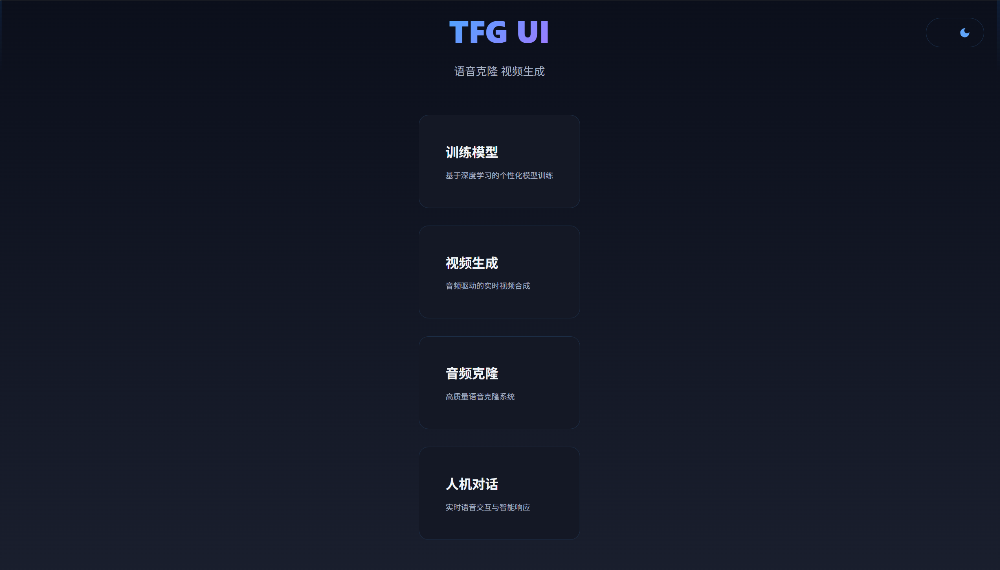
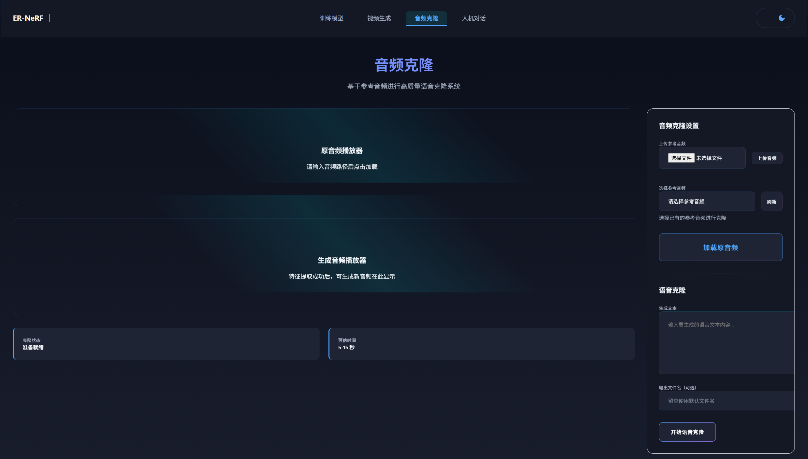
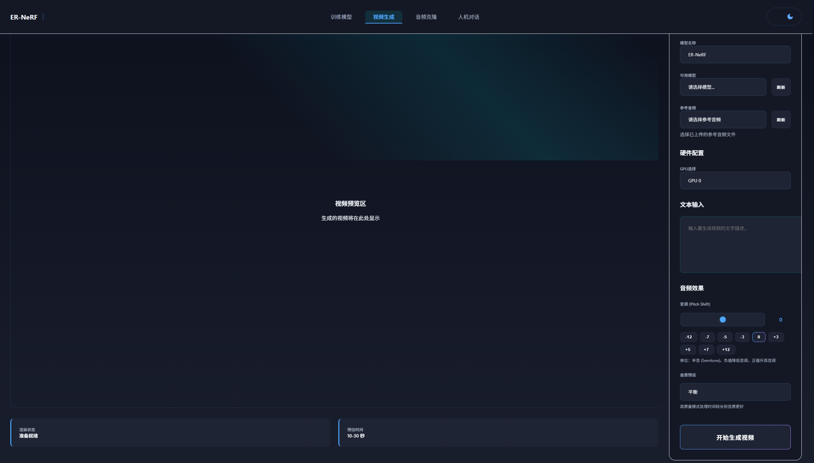
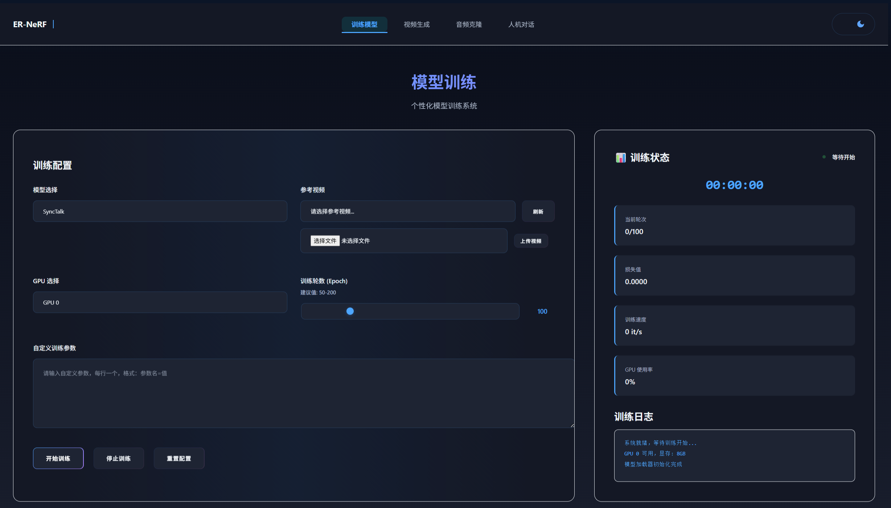
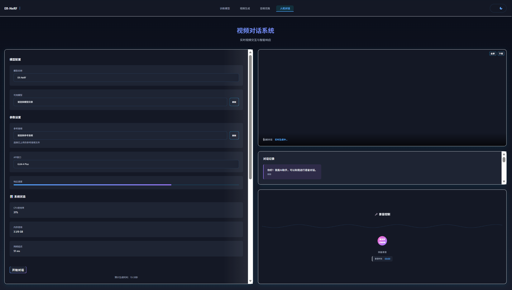

## 界面预览

<table>
<tr>
<td></td>
<td></td>
</tr>
<tr>
<td></td>
<td></td>
</tr>
<tr>
<td></td>
</tr>
</table>

## 功能

- **语音克隆**: CosyVoice、OpenVoice、MeloTTS
- **视频生成**: ER-NeRF、SyncTalk
- **模型训练**: 深度学习模型三阶段训练
- **对话系统**: 人机交互

## 快速开始

```bash
# 安装
git clone https://github.com/3uyuan1ee/TFG_ui.git
cd TFG_ui
git submodule update --init --recursive
python -m venv venv
source venv/bin/activate  # Windows: venv\Scripts\activate
cd EchOfU
pip install -r requirements.txt

# 启动
python app.py
```

访问 http://localhost:5001

## 文档

- [完整配置文档](docs/配置文档.md) - CosyVoice、ER-NeRF部署
- [ER-NeRF部署指南](docs/docker/ERNERF_DEPLOYMENT.md)
- [Docker使用说明](docs/docker/ERNERF_DOCKER.md)

## 常见问题

**Q: 子模块初始化失败**
```bash
git submodule update --init --recursive --depth=1
```

**Q: 国内加速**
```bash
pip install -r requirements.txt -i https://mirrors.aliyun.com/pypi/simple/
```

## 技术栈

Flask 3.0 + PyTorch 2.3 + CosyVoice + ER-NeRF